# FRC是什么
frc全称**fantasy remote copy**,是一款跨平台（当前支持Windows与 macOS）的文本与文件点对点传输软件。

# 项目背景
假如您有两台电脑（包括Windows系统与macOS系统），如果您在其中一台电脑上上网，另一台电脑仅做开发，如果在两台电脑之间传输文件。您可以选择把文本发到微信，然后重复登录微信或者把文本或者文件放到百度云中等。解决方法有很多，但是看起来都不太优雅，尤其是有一点点**强迫症**的人！

该项目的成立的另外一个原因便是实验本人另外一个项目[FantasyMvvm](https://github.com/Snsaiu/FantasyMvvm.git)(基于MAUI的mvvm框架)的可用性。

# 使用前提
* 在用户使用环境中，如果您有两台电脑都在运行，都在身边，那边我便默认您当前电脑都在一个局域网中，如果您的设备都不在同一个局域网中，那么非常遗憾，您将无法使用frc。
* 您的window系统最低要支持到Windows 10，因为frc的开发采用的是微软的[MAUI](https://learn.microsoft.com/zh-cn/dotnet/maui/what-is-maui?view=net-maui-7.0)框架，由于框架本身的限制最低windows 10，所以对于win7系统或者版本更低的用户将无法使用本软件。

# frc工作原理
frc的使用环境是局域网环境，所以在进入一个新的局域网环境中，要先进行一次全局扫描局域网ip，这样才能发现当前哪些局域网的设备是可用状态。
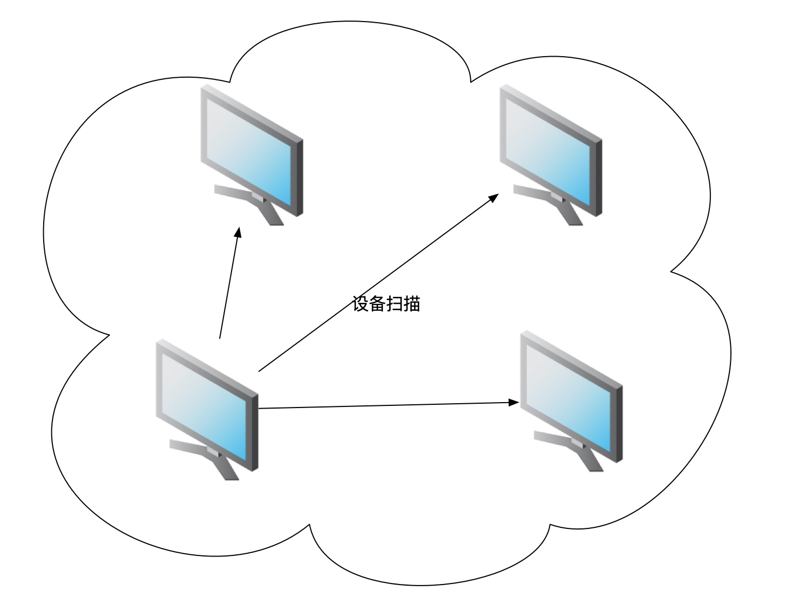
扫描完成后，当前电脑会判断哪些可用设备（设备发现）。判定的标准如下：
1. 被扫描的设备是否安装了frc
2. 如果安装了frc，检测账号信息是否匹配
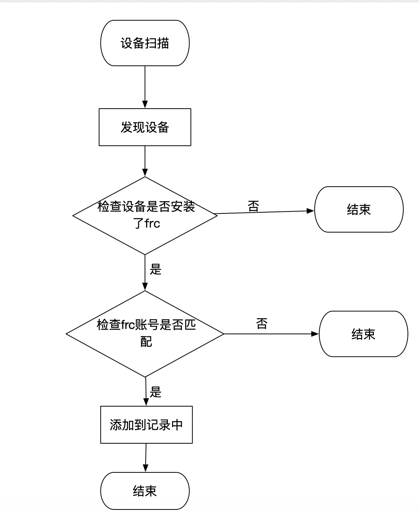

一旦设备扫描结束，在局域网中，您就可以给您指定的设备发送数据了！

# 使用方法

## 注册设备
注册设备要求输入**登录账号**与**设备昵称**。

**登录账号**是作为局域网中哪些设备是归属于您的唯一判断，如果您的**登录账号**叫‘张三’，那么设备发现功能中扫描到的所有叫'张三'的用户设备都会在您的设备中列出来。

**设备昵称**是为您当前设备起一个别名，方便管理。

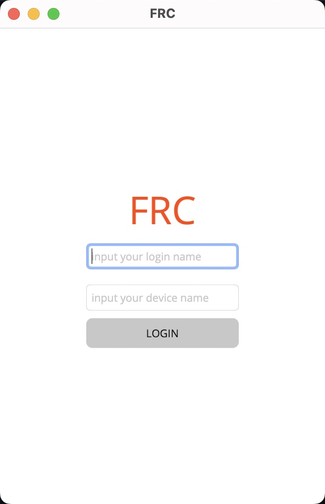

当您注册完成设备后，会持久化到硬盘中，下次再启动软件会自动登录账号，如果您想要退出登录，请到**设置**中点击**LOGOUT**进行退出。
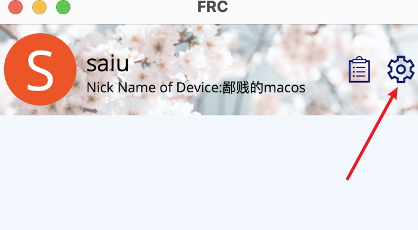
选择**LOGOUT**
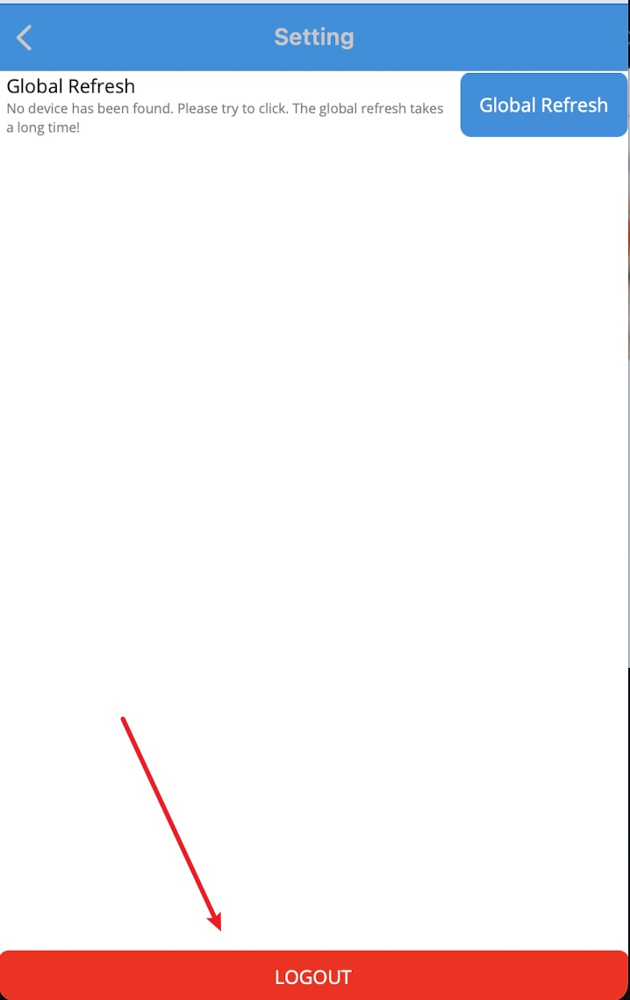

## 主界面介绍

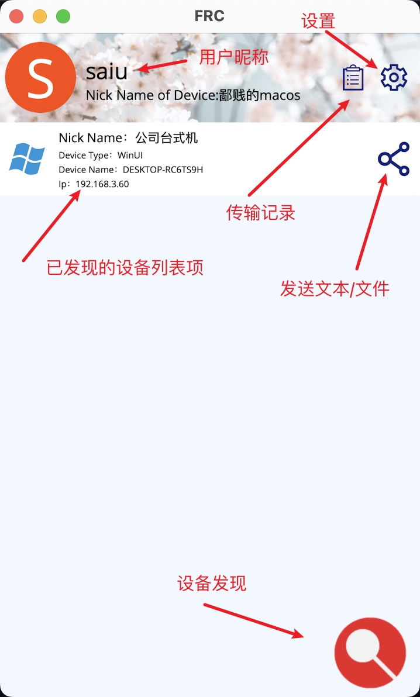
## 发送文本/文件
若要发送文件，选择要发送的设备，点击按钮，会弹出发送类型对话框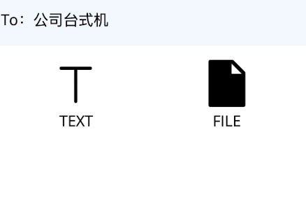。选择要发送的类型即可。

## 历史记录

在历史记录面板里，您可以浏览以往接收的内容，如图：
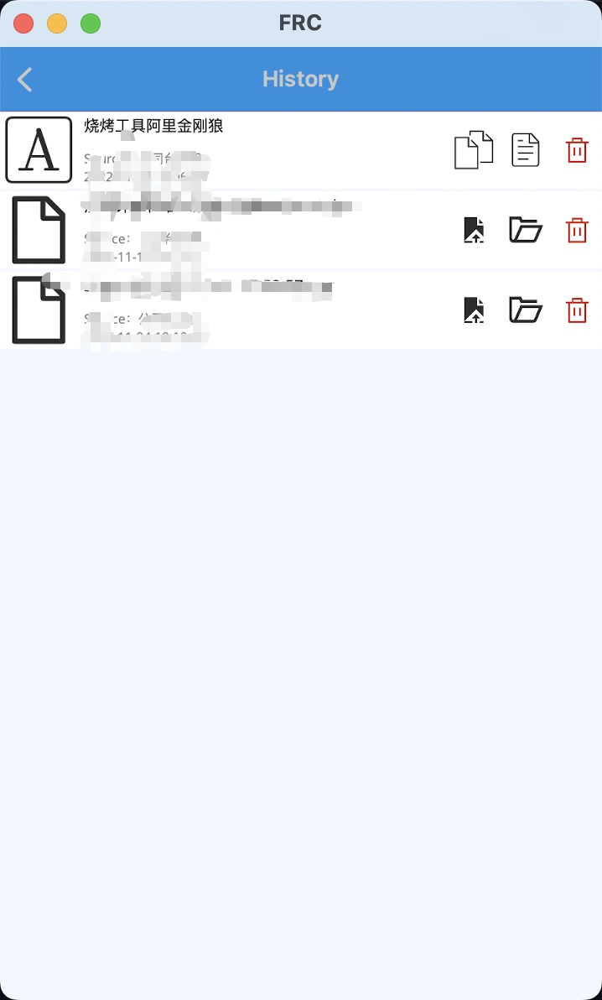
历史记录中包含两种类型列表项目，一种是文本
一种是文件，对于这两种类型有不同的操作选项，如图：
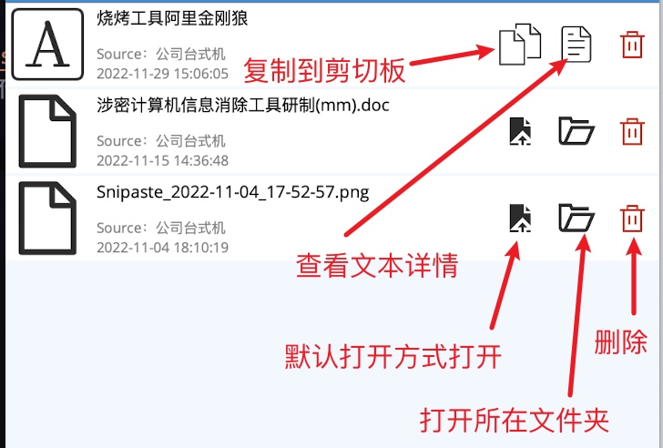

## 搜索当前可用设备
更新当前可用设备

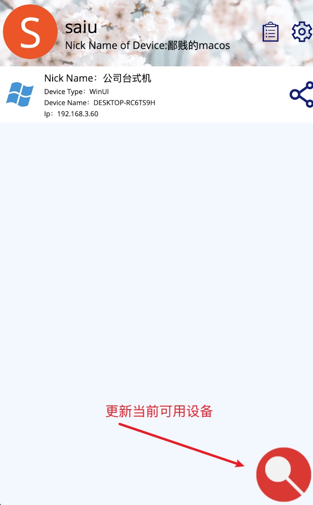

假如您刷新多次也没有出现您的设备，请到设置中选择**全局刷新**
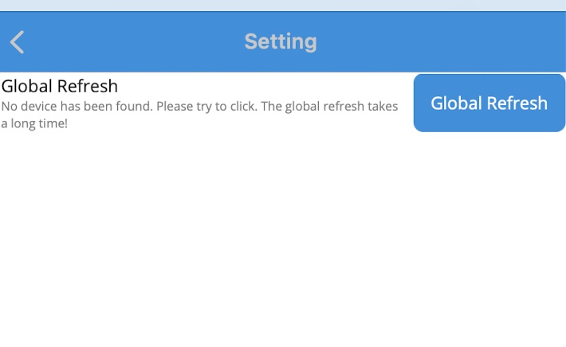

*注意全局刷新会花费一些时间，请耐心等待*

# 当前问题
* 暂时不支持断点续传
# 计划
- [ ] 自定义背景图片
- [ ] 自定义下载路径
- [ ] 下载手动停止
- [ ] 支持android 
